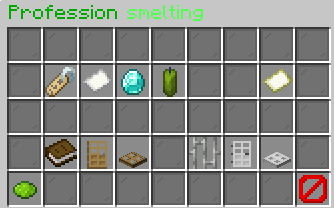
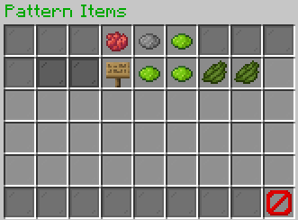
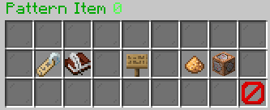
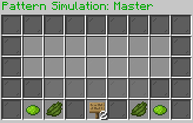
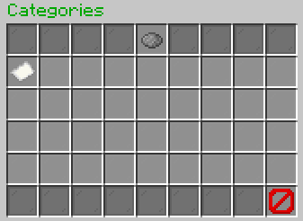
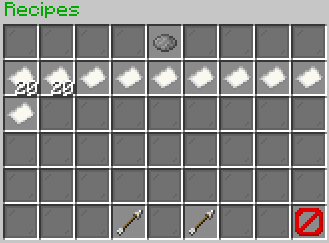

# Fusion Ingame Editor
The ingame editor of Fusion provides you a very easy to use possibility to edit your professions, recipes and everything 
around those. You may come across one or two questions, which you will hopefully find the answer to here.

## Structure of the Editor
The editor is mainly divided into two editors: **Professions Editor** & **Browse Editor** 
Each of those provide many different and some similar functionalities. Similar ones are mostly in the handling of 
pattern items, which is why you will get a detailed explanation of the **Professions Editor**, **Browse Editor** and 
**Pattern Editor** in the following. Smaller Editors will be explained below as well.

## Editor Usage
### Professions Editor
 
The **Profession Editor** starts with a plain gui that allows to configure the following:
- **Name**: The name of the profession (*shown as the nametag*). 
You will be forwarded to a click message in the chat in order to type in a new name for the profession.
  - Shown as: Nametag
  - Usage: `/fusion-editor <name>`
  
- **Icon**: The icon of the profession (*shown next to the nametag*). You will be forwarded to a click message in the 
chat in order to type in a new icon item for the profession.
  - Shown as: Paper
  - Usage: `/fusion-editor <icon>`
      
- **Mastery Unlock**: The required profession-level in order to master this profession. You can increase or decrease 
the amount inside of the gui itself.
  - Shown as: Diamond 
  - Usage:
    - Left Click: Increase the level by 1
    - Right Click: Decrease the level by 1
    - Shift + Click: Manage each by 10
  
- **Mastery Cost**: The cost to master this profession. You can increase or decrease the amount inside of the gui itself. 
This feature requires Vault to be installed.
  - Shown as: Green Candle
  - Usage:
    - Left Click: Increase the cost by 1
    - Right Click: Decrease the cost by 1
    - Shift + Click: Manage each by 100
  
- **Recipes**: The recipes gui of the profession. Here you will add and edit recipes in detail.
  - Shown as: Map
  - Usage: Click on the item to navigate to the [Recipes Editor](#using-recipe-editor)
  
- **Use Categories**: Rather you want to split the recipes guis of `/craft use <profession` into sub-categories or not. 
Keep in mind to configure the category pattern properly when you set this to `true`.
    - Shown as: Book
    - Usage: Click on the item to toggle between `true` and `false`
  
- **Pattern Items**: This one is like the "main" pattern for your recipes.
  - Shown as: Oak Door
  - Usage: Navigate to [Pattern Items Editor](#pattern-items-editor)
  
- **Pattern**: A simulation of the gui how it should look in the end.
  - Shown as: Oak Trapdoor
  - Usage: Navigate to [Pattern Editor](#pattern-editor)
  
- **Categories**: The categories gui of the profession.
  - Shown as: Iron Bars
  - Usage:
    - Click on the **gray dye**: Add a new category. You will be forwarded to a click message in the chat in order to 
    add a new category.
    - **Left Click**: Configure the category. You will be forwarded to a click message in the chat in order to configure.
    - **Right Click**: Remove the category.
    - More information under [Categories Editor](#using-categories-editor)
  
- **Category Pattern Items**: This one is like the subordinated pattern for your recipes. It will be used for your 
categories when **Use Categories** is on `true`.
  - Shown as: Iron Door
  - Usage: Navigate to [Pattern Items Editor](#pattern-items-editor)
  
- **Category Pattern**: A simulation of the gui how it should look in the end. It will be used for your
  categories when **Use Categories** is on `true`.
  - Shown as: Iron Trapdoor
  - Usage: Navigate to [Pattern Editor](#pattern-editor)
  
- **Save**: Save the profession into the config. This changes are final and can't be undone.
  - Shown as: Lime dye
  - Usage: Click on the item to save the profession.
  
- **Back**: Close the gui without any changes yet. You can type back `/fusion-editor` without arguments to reopen this gui.
  - Shown as: Barrier
  - Usage: Click on the item to close the gui.
### Browse Editor
### Using Pattern Editor
#### Pattern Items Editor
 
Here you can modify the pattern items of your profession. The gui provides you the following functionalities:
- **Add**: Add a new pattern item by clicking on any item in your own inventory. It will get an automatic free char and 
will be added into the gui. Due to some limitations yet you can only use 37 items here, which should be more than enough.
  - Shown as: Info under the **Gray Dye**
  - Usage: Click on an item in your inventory to add a new pattern item.
  
- **Undo**: Undo your last action on this gui. It will not affect the sub gui for the pattern item itself.
  - Shown as: Red Dye (top row)
  - Usage: Click to remove the last change done.
  
- **Redo**: Redo your last action on this gui. It will not affect the sub gui for the pattern item itself.
  - Shown as: Lime Dye (top row)
  - Usage: Click to redo the last change done.
  
- **Pattern Item**: These are the items that you find from rows 2-4. You can interact with those to do changes.
  - Shown as: Item represented by pattern material
  - Usage:
    - **Left Click**: Configure the item under [Pattern Item Editor](#configuring-of-pattern-items)
    - **Right Click**: Remove the item from the pattern
  
- **Back**: Go back to the [Profession Editor](#professions-editor).
  - Shown as: Barrier
  - Usage: Click to go back to the profession editor.
  

#### Configuring of Pattern Items
 
Here you can configure each pattern Item individually. The gui provides you the following functionalities:
- **Name**: The name of the pattern item. This will be shown in the pattern gui. You will be forwarded to a click 
message in the chat in order to type in a new name for the item. (`/fusion-editor <name>`)
  - Shown as: Nametag
  - Usage: Click on the item to type in a new name.
  
- **Lore**: The lore of the pattern item. This will be shown in the pattern gui. You will be forwarded to a click message
in the chat in order to type in a new lore for the item. (`/fusion-editor <lore>`)
  - Shown as: Writable Book
  - Usage: 
    - **Left Click**: Add a new lore line
    - **Right Click**: Remove the last lore line
  
- **Icon**: The icon of the pattern item. This will be shown in the pattern gui. You will be forwarded to a click message
in the chat in order to type in a new icon item for the item. (`/fusion-editor <icon> <amount>`)
  - Shown as: Oak Sign
  - Usage: Click on the item to type in a new icon and amount.
  
- **Glowing**: TODO UNFINISHED YET (More details incoming instead)
  
- **Commands**: The commands that will be executed when the pattern item is clicked. You will be forwarded to a click
message in the chat in order to type in a new command for the item. (`/fusion-editor <caster> <dela> <command without />`)
  - Shown as: Command Block
  - Usage: 
    - **Left Click**: Add a new command
    - **Right Click**: Remove the last command
#### Pattern Editor
 
You task in this gui is quite simple by cycling forward or backward the pattern items that you defined in 
[Pattern Items Editor](#pattern-items-editor). The gui only consist of pattern items.
- Usage:
  - **Left Click**: Go forward in the pattern
  - **Right Click**: Go backward in the pattern
  - **ESC**: Close the gui and temporary save the pattern
### Using Categories Editor
 
Here you will be able to manage the categories of your profession. The gui provides you the following functionalities:
- **Add**: Add a new category. You will be forwarded to a click message in the chat in order to add a new category.
  (`/fusion-editor <categoryName> <categoryIcon>`)
  - Shown as: Info under the **Gray Dye**
  - Usage: Click on the item to add a new category.
  
- **Category Icon**: The icon of the category. You will be forwarded to a click message in the chat in order to change 
the name and icon of the category. (`/fusion-editor <categoryName> <categoryIcon>`)
  - Shown as: Paper
  - Usage: 
    - **Left Click**: Change the name and icon of the category
    - **Right Click**: Remove the category
    - **Shift + Click**: Change the order of the category (WIP)
### Using Recipe Editor
 
