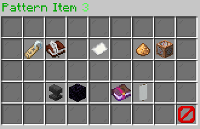
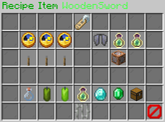

# Fusion Ingame Editor

The ingame editor of Fusion provides you a very easy to use possibility to edit your professions, recipes and everything
around those. You may come across one or two questions, which you will hopefully find the answer to here.

## Structure of the Editor

The editor is mainly divided into two editors: **Professions Editor** & **Browse Editor** 
Each of those provide many different and some similar functionalities. Similar ones are mostly in the handling of
pattern items, which is why you will get a detailed explanation of the **Professions Editor**, **Browse Editor** and
**Pattern Editor** in the following. Smaller Editors will be explained below as well.

## Editor Usage

### Professions Editor

 
The **Profession Editor** starts with a plain gui that allows to configure the following:

- **Name**: The name of the profession
  You will be forwarded to a click message in the chat in order to type in a new name for the profession.
    - Shown as: Nametag
    - Usage: `/fusion-editor <name>`
        
- **Icon**: The icon of the profession. You will be forwarded to a click message in the
  chat in order to type in a new icon item for the profession.
    - Shown as: Paper
    - Usage: `/fusion-editor <icon>`
        
- **Mastery Unlock**: The required profession-level in order to master this profession. You can increase or decrease
  the amount inside of the gui itself.
    - Shown as: Diamond
    - Usage:
        - Left Click: Increase the level by 1
        - Right Click: Decrease the level by 1
        - Shift + Click: Manage each by 10
            
- **Mastery Cost**: The cost to master this profession. You can increase or decrease the amount inside of the gui
  itself.
  This feature requires Vault to be installed.
    - Shown as: Green Candle
    - Usage:
        - Left Click: Increase the cost by 1
        - Right Click: Decrease the cost by 1
        - Shift + Click: Manage each by 100
            
- **Recipes**: The recipes gui of the profession. Here you will add and edit recipes in detail.
    - Shown as: Map
    - Usage: Click on the item to navigate to the [Recipes Editor](#using-recipe-editor)
        
- **Use Categories**: Rather you want to split the recipes guis of `/craft use <profession` into sub-categories or not.
  Keep in mind to configure the category pattern properly when you set this to `true`.
    - Shown as: Book
    - Usage: Click on the item to toggle between `true` and `false`
        
- **Pattern Items**: This one is like the "main" pattern for your recipes.
    - Shown as: Oak Door
    - Usage: Navigate to [Pattern Items Editor](#pattern-items-editor)
        
- **Pattern**: A simulation of the gui how it should look in the end.
    - Shown as: Oak Trapdoor
    - Usage: Navigate to [Pattern Editor](#pattern-editor)
        
- **Categories**: The categories gui of the profession.
    - Shown as: Iron Bars
    - Usage:
        - Click on the **gray dye**: Add a new category. You will be forwarded to a click message in the chat in order
          to
          add a new category.
        - **Left Click**: Configure the category. You will be forwarded to a click message in the chat in order to
          configure.
        - **Right Click**: Remove the category.
        - More information under [Categories Editor](#using-categories-editor)
            
- **Category Pattern Items**: This one is like the subordinated pattern for your recipes. It will be used for your
  categories when **Use Categories** is on `true`.
    - Shown as: Iron Door
    - Usage: Navigate to [Pattern Items Editor](#pattern-items-editor)
        
- **Category Pattern**: A simulation of the gui how it should look in the end. It will be used for your
  categories when **Use Categories** is on `true`.
    - Shown as: Iron Trapdoor
    - Usage: Navigate to [Pattern Editor](#pattern-editor)
        
- **Save**: Save the profession into the config. This changes are final and can't be undone.
    - Shown as: Lime dye
    - Usage: Click on the item to save the profession.
        
- **Back**: Close the gui without any changes yet. You can type back `/fusion-editor` without arguments to reopen this
  gui.
    - Shown as: Barrier
    - Usage: Click on the item to close the gui.

### Browse Editor
 
The **Browse Editor** is used to configure the Browse Gui from `/craft browse` where you usually select the professions you join.
You can configure the following:
- **Name**: The name of the browse gui
  You will be forwarded to a click message in the chat in order to type in a new name for the browse gui.
    - Shown as: Nametag
    - Usage: Click on the item to type in a new name.
  
- **Pattern Items**: The pattern of the browse gui.
  - Shown as: Oak Door
  - Usage: Navigate to [Pattern Items Editor](#pattern-items-editor)
  
- **Pattern**: A simulation of the gui how it should look in the end.
  - Shown as: Oak Trapdoor
  - Usage: Navigate to [Pattern Editor](#pattern-editor)
  
- **Professions**: The professions of the browse gui. Here you will add and edit professions in detail.
  - Shown as: Chest
  - Usage: Click on the item to navigate to the [Browse Professions Editor](#browse-professions)
  
- **Save**: Save the browse gui into the config. This changes are final and can't be undone.
  - Shown as: Lime dye
  - Usage: Click on the item to save the browse gui.
  
- **Back**: Close the gui without any changes yet. You can type back `/fusion-editor` without arguments to reopen this
  gui.
  - Shown as: Barrier
  - Usage: Click on the item to close the gui.

### Using Pattern Editor
#### Pattern Items Editor
 
Here you can modify the pattern items of your profession. The gui provides you the following functionalities:

- **Add**: Add a new pattern item by clicking on any item in your own inventory. It will get an automatic free char and
  will be added into the gui. Due to some limitations yet you can only use 37 items here, which should be more than
  enough.
    - Shown as: Info under the **Gray Dye**
    - Usage: Click on an item in your inventory to add a new pattern item.
        
- **Undo**: Undo your last action on this gui. It will not affect the sub gui for the pattern item itself.
    - Shown as: Red Dye (top row)
    - Usage: Click to remove the last change done.
        
- **Redo**: Redo your last action on this gui. It will not affect the sub gui for the pattern item itself.
    - Shown as: Lime Dye (top row)
    - Usage: Click to redo the last change done.
        
- **Pattern Item**: These are the items that you find from rows 2-4. You can interact with those to do changes.
    - Shown as: Item represented by pattern material
    - Usage:
        - **Left Click**: Configure the item under [Pattern Item Editor](#configuring-of-pattern-items)
        - **Right Click**: Remove the item from the pattern
            
- **Back**: Go back to the [Profession Editor](#professions-editor).
    - Shown as: Barrier
    - Usage: Click to go back to the profession editor.
        

#### Configuring of Pattern Items
 
Here you can configure each pattern Item individually. The gui provides you the following functionalities:

- **Name**: The name of the pattern item. This will be shown in the pattern gui. You will be forwarded to a click
  message in the chat in order to type in a new name for the item. (`/fusion-editor <name>`)
    - Shown as: Nametag
    - Usage: Click on the item to type in a new name.
        
- **Lore**: The lore of the pattern item. This will be shown in the pattern gui. You will be forwarded to a click
  message
  in the chat in order to type in a new lore for the item. (`/fusion-editor <lore>`)
    - Shown as: Writable Book
    - Usage:
        - **Left Click**: Add a new lore line
        - **Right Click**: Remove the last lore line
            
- **Icon**: The icon of the pattern item. This will be shown in the pattern gui. You will be forwarded to a click
  message
  in the chat in order to type in a new icon item for the item. (`/fusion-editor <icon> <amount>`)
    - Shown as: Oak Sign
    - Usage: Click on the item to type in a new icon and amount.
        
- **Glowing**: TODO UNFINISHED YET (More details incoming instead)
    
- **Commands**: The commands that will be executed when the pattern item is clicked. You will be forwarded to a click
  message in the chat in order to type in a new command for the
  item. (`/fusion-editor <caster> <delay> <command without />`)
    - Shown as: Command Block
    - Usage:
        - **Left Click**: Add a new command
        - **Right Click**: Remove the last command

#### Pattern Editor
 
You task in this gui is quite simple by cycling forward or backward the pattern items that you defined in
[Pattern Items Editor](#pattern-items-editor). The gui only consist of pattern items.

- Usage:
    - **Left Click**: Go forward in the pattern
    - **Right Click**: Go backward in the pattern
    - **ESC**: Close the gui and temporary save the pattern

### Using Categories Editor
 
Here you will be able to manage the categories of your profession. The gui provides you the following functionalities:

- **Add**: Add a new category. You will be forwarded to a click message in the chat in order to add a new category.
  (`/fusion-editor <categoryName> <categoryIcon>`)
    - Shown as: Info under the **Gray Dye**
    - Usage: Click on the item to add a new category.
        
- **Category Icon**: The icon of the category. You will be forwarded to a click message in the chat in order to change
  the name and icon of the category. (`/fusion-editor <categoryName> <categoryIcon>`)
    - Shown as: Paper
    - Usage:
        - **Left Click**: Change the name and icon of the category
        - **Right Click**: Remove the category
        - **Shift + Click**: Change the order of the category (WIP)
### Using Recipes Editor
#### Recipes Editor
 
Here you will be able to manage the recipes of your profession. The gui provides you the following functionalities:

- **Add**: Add a new recipe. You will be forwarded to a click message in the chat in order to add a new recipe.
  (`/fusion-editor <recipeName> <recipeIcon> <amount>`)
    - Shown as: **Gray Dye**
    - Usage: Click on the item to add a new recipe.
        
- **Previous Page**: Go to the previous page of recipes.
    - Shown as: **Arrow (left)**
    - Usage: Click on the item to go to the previous page.
        
- **Next Page**: Go to the next page of recipes.
    - Shown as: **Arrow (right)**
    - Usage: Click on the item to go to the next page.
- **Recipe Icon**: The recipes that are shown in the gui. You manage them by clicking on the item.
    - Shown as: Paper
    - Usage:
        - **Left Click**: Configure the recipe. You will be forwarded to [Recipe Item Editor](#recipe-item-editor)
        - **Right Click**: Remove the recipe
        - **Shift + Click**: Change the order of the recipe (WIP)
- **Back**: Go back to the [Profession Editor](#professions-editor).
    - Shown as: Barrier
    - Usage: Click to go back to the profession editor.

#### Recipe Item Editor
 
Lets come to the main part of the editor. Here you can configure the recipe in detail. The gui provides you the
following functionalities:

- **Name**: The name of the recipe. This will be shown in the recipe gui. You will be forwarded to a click message in
  the chat in order to type in a new name for the recipe. (`/fusion-editor <name>`)
    - Shown as: Nametag
    - Usage: Click on the item to type in a new name.
        
- **Category**: The category of the recipe. You can cycle through it to change the category if more than one exists.
    - Shown as: Iron Bars
    - Usage:
        - **Left Click**: Go forward in the categories
        - **Right Click**: Go backward in the categories
            
- **Crafting Time**: The time that is required to craft the recipe. You can increase or decrease the amount inside of
  the gui itself.
    - Shown as: Clock
    - Usage:
        - Left Click: Increase the time by 1
        - Right Click: Decrease the time by 1
        - Shift + Click: Manage each by 10
- **Result Item**: The item that will be crafted. You will be forwarded to a click message in the chat in order to type
  in a new item for the recipe. (`/fusion-editor <item> <amount>`)
    - Shown as: Item represented by pattern material
    - Usage: Click on the item to change item and amount.
        
- **Profession Exp Gain**: The amount of profession experience that will be gained when the recipe is crafted. You can
  increase or decrease the amount inside of the gui itself.
    - Shown as: Experience Bottle (top-left)
    - Usage:
        - Left Click: Increase the amount by 1
        - Right Click: Decrease the amount by 1
        - Shift + Click: Manage each by 10
            
- **Vanilla Exp Gain**: The amount of vanilla experience that will be gained when the recipe is crafted. You can
  increase or decrease the amount inside of the gui itself.
    - Shown as: Experience Bottle (top-right)
    - Usage:
        - Left Click: Increase the amount by 1
        - Right Click: Decrease the amount by 1
        - Shift + Click: Manage each by 10
- **Commands**: The commands that will be executed when the recipe is crafted. You will be forwarded to a click message
  in the chat in order to type in a new command for the recipe. (`/fusion-editor <caster> <delay> <command without />`)
    - Shown as: Command Block
    - Usage:
        - **Left Click**: Add a new command
        - **Right Click**: Remove the last command
            
- **Ingredients**: The ingredients that are required to craft the recipe. You will be forwarded to a click message in
  the
  chat in order to type in a new ingredient for the recipe. (`/fusion-editor <item> <amount>`)
    - Shown as: Glass Bottle
    - Usage:
        - **Left Click**: Add a new ingredient
        - **Right Click**: Remove the last ingredient
            
- **Money Cost**: The money that is required to craft the recipe. You can increase or decrease the amount inside of the
  gui itself. This feature requires Vault to be installed.
    - Shown as: Green Candle
    - Usage:
        - Left Click: Increase the cost by 1
        - Right Click: Decrease the cost by 1
        - Shift + Click: Manage each by 100
            
- **Exp Cost**: The vanilla experience that is required to craft the recipe. You can increase or decrease the amount
  inside of the
  gui itself.
    - Shown as: Lime Candle
    - Usage:
        - Left Click: Increase the cost by 1
        - Right Click: Decrease the cost by 1
        - Shift + Click: Manage each by 10
            
- **Needed Profession Level**: The profession level that is required to craft the recipe. You can increase or decrease
  the amount inside of the
  gui itself.
    - Shown as: Experience Bottle (bottom-left)
    - Usage:
        - Left Click: Increase the level by 1
        - Right Click: Decrease the level by 1
        - Shift + Click: Manage each by 10
            
- **Mastery**: Rather the recipe is a mastery recipe or not. You can toggle between `true` and `false`.
  Enabling means you need to have mastered the profession before crafting.
    - Shown as: Diamond
    - Usage: Click on the item to toggle between `true` and `false`
        
- **Conditions**: The conditions that are required to craft the recipe. You will be forwarded to a click message in the
  chat in order to type in a new condition for the recipe. (`/fusion-editor <conditionKey> <conditionValue> <level>`).
  The specific conditions that are possible will be listed under [Conditions](#conditions).
    - Shown as: Chest
    - Usage:
        - **Left Click**: Add a new condition
        - **Right Click**: Remove the last condition
- **Back**: Go back to the [Recipes Editor](#using-recipe-editor).
    - Shown as: Barrier
    - Usage: Click to go back to the recipes editor.

### Working with Professions in Browse Editor
#### Browse Professions
 
This gui works kind of equivalent to [Recipes Editor](#recipes-editor) but is used to configure professions in the
browse gui instead. The following functionalities are provided:
- **Add**: Add a new profession. You will be forwarded to a click message in the chat in order to add a profession into
  the gui. Keep in mind that this profession should already exist since you can only register existent professions.
  If you need to create a new profession, look under [Creating Profession](#creating-profession).
  (`/fusion-editor <professionName>`)
    - Shown as: **Gray Dye**
    - Usage: Click on the item to add a new profession.
  
- **Previous Page**: Go to the previous page of professions.
  - Shown as: **Arrow (left)**
  - Usage: Click on the item to go to the previous page.
  
- **Next Page**: Go to the next page of professions.
  - Shown as: **Arrow (right)**
  - Usage: Click on the item to go to the next page.
  
- **Profession Icon**: The professions that are shown in the gui. You manage them by clicking on the item.
  - Shown as: Paper
  - Usage:
      - **Left Click**: Configure the profession. You will be forwarded to [Browse Profession Editor](#configuring-of-a-profession)
      - **Right Click**: Remove the profession
      - **Shift + Click**: Change the order of the profession (WIP)
  
- **Back**: Go back to the [Browse Editor](#browse-editor).
  - Shown as: Barrier
  - Usage: Click to go back to the browse editor.
  
#### Configuring of a Profession
 
Here you can configure each profession-icon individually. The gui provides you the following functionalities:
- **Money Cost**: The money that is required to join the profession. You can increase or decrease the amount inside of
  the gui itself. This feature requires Vault to be installed.
    - Shown as: Green Candle
    - Usage:
        - Left Click: Increase the cost by 1
        - Right Click: Decrease the cost by 1
        - Shift + Click: Manage each by 100
  
- **Exp Cost**: The vanilla experience that is required to join the profession. You can increase or decrease the amount
  inside of the
  gui itself.
    - Shown as: Lime Candle
    - Usage:
        - Left Click: Increase the cost by 1
        - Right Click: Decrease the cost by 1
        - Shift + Click: Manage each by 10
  
- **Ingredients**: The ingredients that are required to join the profession. You will be forwarded to a click message in
  the
  chat in order to type in a new ingredient for the profession. (`/fusion-editor <item> <amount>`)
    - Shown as: Glass Bottle
    - Usage:
        - **Left Click**: Add a new ingredient
        - **Right Click**: Remove the last ingredient
- **Conditions**: The conditions that are required to join the profession. You will be forwarded to a click message in the
  chat in order to type in a new condition for the profession. (`/fusion-editor <conditionKey> <conditionValue> <level>`).
  The specific conditions that are possible will be listed under [Conditions](#conditions).
    - Shown as: Chest
    - Usage:
        - **Left Click**: Add a new condition
        - **Right Click**: Remove the last condition
  
- **Back**: Go back to the [Browse Professions](#browse-professions).
    - Shown as: Barrier
    - Usage: Click to go back to the browse professions.
## Extra information
### Creating Profession
If you want to create a new profession, you have to possibilities:
- Either you type in `/fusion-editor <newProfession>` to generate a profession from scratch with default values
- Or you type in `/fusion-editor <newProfession> <existingProfession>` to generate a profession that copies everything 
from another profession.

### Divinity-Items
Most of the item-commands of the `/fusion-editor` allow for usage of [Divinity](https://www.spigotmc.org/resources/divinity-custom-item-generator-by-magemonkey-studio-formerly-prorpgitems.99713/)-Items 
from the CustomItems-Module. It is planned to allow for further customization of divinity items from other modules too.
  
You use them by typing `DIVINITY_` in the command. It will autofill all possible items, when you have installed Divinity.
### Conditions

Conditions are a way to restrict the crafting of a recipe. You can add multiple conditions to a recipe or even before
being able to use a profession. Most of the conditions are related to third party plugins that are used as hooks to
allow for more customization. The following conditions are available:

| Condition Key       | Possible Condition Values      | Belong to (Hooks)                                                                                                  |
|---------------------|--------------------------------|--------------------------------------------------------------------------------------------------------------------|
| profession          | Any profession of this plugin  | Natively, Fusion                                                                                                   |
| fabled              | Classe-IDs of Fabled           | [Fabled](https://www.spigotmc.org/resources/fabled-an-rpg-engine-by-magemonkey-studio-formerly-proskillapi.91913/) |
| mcmmo               | PrimarySkillTypes of mcMMO     | [mcMMO](https://www.spigotmc.org/resources/official-mcmmo-original-author-returns.64348/)                          |
| jobs                | Levels of Jobs                 | [JobsReborn](https://www.spigotmc.org/resources/jobs-reborn.4216/)                                                 |
| aura_abilities      | Abilities from AuraSkills      | [AuraSkills](https://www.spigotmc.org/resources/auraskills.81069/)                                                 |
| aura_mana_abilities | Mana Abilities from AuraSkills | [AuraSkills](https://www.spigotmc.org/resources/auraskills.81069/)                                                 |
| aura_skills         | Skills from AuraSkills         | [AuraSkills](https://www.spigotmc.org/resources/auraskills.81069/)                                                 |
| aura_stats          | Stats from AuraSkills          | [AuraSkills](https://www.spigotmc.org/resources/auraskills.81069/)                                                 |
