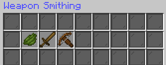
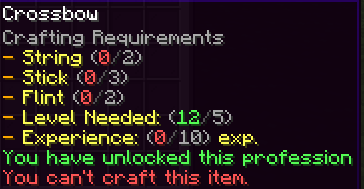
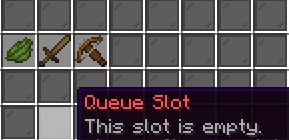
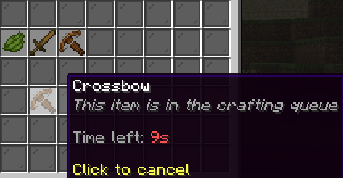
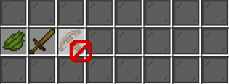

# Handling Professions
## General Configuration

## Browsing
### Usage
You open the browse gui with the command `/craft browse`.

<br>

In case you dont want to open the browse gui all the time, you can also skip it by using `/craft join <profession>`

Leaving a profession is also possible with `/craft forget <profession>`. You will then have to confirm your action by typing `/craft confirm` again.

### BrowseGui configuration
The browse gui is used to browse all configurated professions that are available to the player. 
With that being said: Yes, you can also put some professions on 'draft' and edit them until you are satisfied a the creator.
Once the professions are finish, integrate them into the browse gui and let the player choose from them.

You can either use the [Ingame-Editor](../EditorUsage.md) or the config file below which explaines the structure of the browse config:
<details open>
  <summary>Show browse.yml</summary>
  This is the default config that will be generated when you fresh install Fusion or delete the file.

  ```yaml
    # The name of the browse gui
    name: '&3&lBrowse'
    # The Pattern of how you gui is build
    pattern:
      # This is the structure of you items below
      pattern:
        - '111101111'
        - ooooooooo
        - ooooooooo
      # This section allow for custom commands on specific items. For example 'commands.'1' would provide a list of commands that will be executed when the player clicks on the item in the gui.
      # Further details: [TODO]
      commands: {}
      # Those are the items that you can customize inside of the gui. You see that each char represents one item in the pattern above.
      items:
        '0':
          material: BIRCH_SIGN
          amount: 1
          durability: 0
          unbreakable: false
          name: §3Crafting Groups
          lore:
            - §7Select a profession
          flags: []
          enchants: {}
          data: null
        '1':
          material: CYAN_STAINED_GLASS_PANE
          amount: 1
          durability: 0
          unbreakable: false
          name: ' '
          lore: []
          flags: []
          enchants: {}
          data: null
    # Here, you can see all professions that are enabled through the plugin. When a profession is not added here, it cant be used by the players.
    professions:
      # This is the armor smithing profession that is added on fresh install
      armor_smithing:
        # Here is the cost section. Further infos: [TODO]
        costs:
          exp: 10
        # Here is the condition section. Further infos: [TODO]
        conditions: {}
      weapon_smithing:
        costs:
          money: 5
        conditions: {}
  ```
</details>

## Professions & Recipes
### Crafting recipes
Lets come to the best part about Fusion: **The crafting mechanisms**
As shown unter the [General Configuration](#General-Configuration) you can have two different types of crafting mechanism. One is the **Queue**, while the other is the **Manual**.
Both mechanism start inside of a gui, where you can see the recipes or specific categories of the recipes depending on how you configured your professions.

First, we open the gui by typing `/craft use <profession>`.

In this simple case we have a wooden sword and cross bow available:
<br>

The green dye in this example represents a navigation button to get into the previous page. This can either be a category gui for this profession, or another 'page' of those recipes here (This gui is configured to always show a max. of 5 recipes at the same time).

While hovering on the item, you can see what is required for this recipe to be craftable:

<br>

Those requirements are usually seperated into two sections in the configs.<br>

The one is the `costs`-section where you can determine which items are used, how much money it costs (Vault required), as well as the amount of vanilla exp required.<br>
The second one is the `conditions`-section, which are conditions that need be fulfilled, but dont take any consumption. This can be stuff like achieving a specific level in a profession, hooked values from other supported plugins, and so on. Its represented as 'Level Needed' in the example.

This is the part of crafting that is always the same. Now lets look further into the different mechanisms.

#### Queue-Mechanism
Queue is a mechanism that allows you to queue multiple recipes in a row so that once the first is finished, the seconds 'starts' to craft in the **background**.
Those queue-slots are defined as a '-' in the pattern of your gui, which can look like the following:
<br>

You then click on the desired recipe to add this item into the queue:
<br>
The item now runs in the background and allows to do other tasks without having to look at this recipe the whole time.
Clicking on the recipe while working cancels the queue-task and refunds you the items, if properly configured. 
Doing so after it finished provides you the item into the inventory (or drops it, if you have no space in inventory).

#### Manual-Mechanism
While explaining the queue-mechanism with the comfortable background option, you might guess what the manual mechanism does.
Once you click on the recipe here, you will get a barrier in you inventory and a boss bar occurs at the top of your screen:

<br>
<br>

This option requires the player to stay inside of this gui until it is finished. 
You see the progress of the recipe at the bossbar which updates continously to show the progress.

The process is cancellable through clicking again on the recipe with your barrier, or pressing ESC. 
The ingredients will be refunded again.

If the player has the permission `fusion.auto` he is permitted to use the comfortable way of `/craft auto` which allows 
to continously craft those steps until the inventory is full or until he lacks on ingredients. 
You can also combine this function smartly into the gui by adding the following pattern-item for example:

<details open>
  <summary>Integrate a auto-craft button to switch</summary>

   ```yaml
    pattern:
      items:
        '3':
          material: PAPER
          modelData: 201
          amount: 1
          durability: 0
          unbreakable: false
          name: '&6Enable Autocraft'
          lore:
            - ' &7Turn on autocrafting.'
            - '&8--------------------'
            - ' &aLeft click to toggle auto crafting.'
          flags: []
          enchants: {}
          data: null
      commands:
        '3':
          - delay: 0
            as: PLAYER
            cmd: craft auto
   ```
</details>

### Profession configuration
The following part shows you the default configs with some comments to explain the structure of the profession and recipe config.
<details open>
  <summary>Show armor_smithing.yml</summary>
  This is the default armor smithing config that will be generated when you fresh install Fusion or delete the file.

  ```yaml
  # You can configurate those profession ingame via gui
  # Use `/fusion-editor profession armor_smithing` to open the editor for this profession

  # The internal id of profession that is used to identify the profession (for example for `/craft use <profession-id`)
  name: armor_smithing

  # Visuals for the professions in the gui
  icon: iron_chestplate
  inventoryName: '&9Armor Smithing'

  # Rather you want to enable categories for this profession
  useCategories: false

  # The required profession level for mastery
  masteryUnlock: 40
  # The fee to unlock mastery, requires Vault
  masteryFee: 500

  # The pattern setup of your recipe gui
  # This is the main pattern that is used overall when no categories are setup
  pattern:
    pattern:
      - '111111111'
      - 1<ooooo>1
      - '111111111'
      - 1{-----}1
      - '111111111'
      - '111111111'
    commands:
      '3':
        - delay: 0
          as: PLAYER
          cmd: craft auto
    items:
      fillItem:
        material: BLACK_STAINED_GLASS_PANE
        amount: 1
        durability: 0
        unbreakable: false
        name: ' '
        lore: []
        flags: []
        enchants: {}
      <:
        material: GREEN_DYE
        amount: 1
        durability: 0
        unbreakable: false
        name: §ePrev recipes page.
        lore: []
        flags: []
        enchants: {}
      '>':
        material: GREEN_DYE
        amount: 1
        durability: 0
        unbreakable: false
        name: §eNext recipes page.
        lore: []
        flags: []
        enchants: {}
      '{':
        material: LIME_DYE
        amount: 1
        durability: 0
        unbreakable: false
        name: Previous queued items
        lore: []
        flags: []
        enchants: {}
      '}':
        material: LIME_DYE
        amount: 1
        durability: 0
        unbreakable: false
        name: Next queued items
        lore: []
        flags: []
        enchants: {}
      '0':
        material: OAK_SIGN
        amount: 1
        durability: 0
        unbreakable: false
        name: '§6Armor Smithing: §cLevel $<level>'
        lore:
          - ' §7The recipes above can be crafted'
          - ' §7with the armor smithing profession.'
          - §8--------------------
          - ' §7You need level §a40 armor smithing'
          - ' §a& $500 to unlock its §7mastery.'
          - ' §7A mastery allows to craft new items.'
        flags: []
        enchants: {}
      '1':
        material: BLACK_STAINED_GLASS_PANE
        amount: 1
        durability: 0
        unbreakable: false
        name: ' '
        lore: []
        flags: []
        enchants: {}
      '2':
        material: GRAY_DYE
        amount: 1
        durability: 0
        unbreakable: false
        name: §6Example Slot
        lore:
          - ' §7Personalize your crafting menu'
          - ' §7with slots like this one.'
        flags: []
        enchants: {}
      '3':
        material: PAPER
        amount: 1
        durability: 0
        unbreakable: false
        name: §6Enable Autocraft
        lore:
          - ' §7Turn on autocrafting. Epic and '
          - ' §7above can toggle autocrafting!'
          - §8--------------------
          - ' §aLeft click to toggle auto crafting.'
          - §4Keep in mind!
          - ' §7Autocrafting can only be used when'
          - '§7craftingQueue: §afalse §7in §7config.yml§7'
        flags: []
        enchants: {}
      queue-items:
        '-':
          material: GRAY_STAINED_GLASS_PANE
          amount: 1
          durability: 0
          unbreakable: false
          name: §cQueue Slot
          lore:
            - §7This slot is empty.
          flags: []
          enchants: {}
        Unfinished:
          material: '%material%'
          amount: 1
          durability: 0
          unbreakable: false
          name: '&cQueue Slot'
          lore:
            - '&7&oThis item is in the crafting queue'
            - ' '
            - '&7Time left: &c%time%'
            - ' '
            - '&eClick to cancel'
          flags: []
          enchants: {}
        Finished:
          material: '%material%'
          amount: 1
          durability: 0
          unbreakable: false
          name: '&cQueue Slot'
          lore:
            - '&7&oThis item is in the crafting queue'
            - ' '
            - '&7The item is &afinished&7!'
            - ' '
            - '&eClick to obtain'
          flags: []
          enchants: {}
  # The categories that are used for the profession.
  # Since we disabled categories, we can leave this empty
  categories: []

  # The recipes that are shown in this profession
  # The recipes are divided into some main parameters and sub-sections:
  # - name: The internal name of the recipe
  # - craftingTime: The time in seconds it takes to craft the recipe
  # - category: The category the recipe belongs to
  # - results: The result-section of the recipe
  #   - vanillaExp: The amount of vanilla experience the player gets
  #   - item: The item that is given to the player
  #   - professionExp: The amount of profession experience the player gets
  #   - commands: The commands that are executed when the recipe is crafted
  # - costs: The costs-section of the recipe
  #   - money: The amount of money the player has to pay
  #   - exp: The amount of vanilla experience the player has to pay
  #   - items: The items the player has to pay
  # - conditions: The conditions-section of the recipe
  #   - professionLevel: The required profession level
  #   - mastery: Rather the recipe is only craftable with mastery
  #   - <conditions>: Further conditions that can be used. You can look them up here:
  #     https://github.com/magemonkeystudio/fusion/blob/improvements_and_33/doc/EditorUsage.md#conditions
  recipes:
    - name: LeatherHelmet
      craftingTime: 5
      craftingLimit: 1
      results:
        vanillaExp: 5
        item: LEATHER_HELMET
        professionExp: 10
        commands: []
      costs:
        money: 0.0
        exp: 0
        items:
          - LEATHER:5
          - material: ENCHANTED_BOOK
            amount: 2
            enchants:
              unbreaking: 3
      conditions:
        professionLevel: 1
        mastery: false
        rank: null
    - name: IronChestplate
      craftingTime: 20
      craftingLimit: 2
      results:
        vanillaExp: 20
        item: IRON_CHESTPLATE
        professionExp: 50
        commands: []
      costs:
        money: 0.0
        exp: 0
        items:
          - IRON_INGOT:8
      conditions:
        professionLevel: 5
        mastery: false
        rank: null
    - name: DiamondLeggings
      craftingTime: 30
      craftingLimit: 0
      results:
        vanillaExp: 30
        item: DIAMOND_LEGGINGS
        professionExp: 100
        commands: []
      costs:
        money: 0.0
        exp: 0
        items:
          - DIAMOND:7
      conditions:
        professionLevel: 10
        mastery: false
        rank: null
    - name: ChainBoots
      craftingTime: 15
      craftingLimit: 0
      results:
        vanillaExp: 15
        item: CHAINMAIL_BOOTS
        professionExp: 30
        commands: []
      costs:
        money: 0.0
        exp: 0
        items:
          - IRON_INGOT:4
      conditions:
        professionLevel: 15
        mastery: false
        rank: null
        professions:
          weapon_smithing: 5
    - name: ChainBoots2
      craftingTime: 15
      craftingLimit: 0
      results:
        vanillaExp: 15
        item: CHAINMAIL_BOOTS
        professionExp: 30
        commands: []
      costs:
        money: 0.0
        exp: 0
        items:
          - IRON_INGOT:4
      conditions:
        professionLevel: 15
        mastery: false
        rank: null
        professions:
          weapon_smithing: 5
    - name: ChainBoots3
      craftingTime: 15
      craftingLimit: 0
      results:
        vanillaExp: 15
        item: DIAMOND_BOOTS
        professionExp: 30
        commands: []
      costs:
        money: 0.0
        exp: 0
        items:
          - IRON_INGOT:4
          - material: DIAMOND_BOOTS
            name: Test
            amount: 1
            durability: 40
            unbreakable: false
            lore: []
            flags: []
            enchants:
              unbreaking: 5
              efficiency: 4
          - STONE:5
          - DIVINITY_ironore:1
      conditions:
        professionLevel: 15
        mastery: false
        rank: null
        professions:
          weapon_smithing: 5
    - name: TestOre
      craftingTime: 15
      craftingLimit: 0
      results:
        vanillaExp: 15
        item: IRON_INGOT
        professionExp: 30
        commands: []
      costs:
        money: 0.0
        exp: 0
        items:
          - PAPER:2
      conditions:
        professionLevel: 15
        mastery: false
        rank: null
  ```

</details>

<details open>
  <summary>Show weapon_smithing.yml</summary>
  This is the default weapon smithing config that will be generated when you fresh install Fusion or delete the file.

  ```yaml
# You can configurate those profession ingame via gui
# Use `/fusion-editor profession weapon_smithing` to open the editor for this profession

# The internal id of profession that is used to identify the profession (for example for `/craft use <profession-id`)
name: weapon_smithing

# Visuals for the professions in the gui
icon: DIAMOND_SWORD
inventoryName: '&9Weapon Smithing'

# Rather you want to enable categories for this profession
useCategories: true

# The required profession level for mastery
masteryUnlock: 40
# The fee to unlock mastery, requires Vault
masteryFee: 500

# The pattern setup of your recipe gui
# This is the main pattern that is used overall when no categories are setup
pattern:
  # The actual pattern of the items section below.
  pattern:
  - '111111111'
  - 1<ooooo>1
  - '111111111'
  - 1{-----}1
  - '111111111'
  - '111111111'
  # The items that can be used for the pattern section.
  # Each item represents one slot in the pattern.
  # The following characters are predefined for specific tasks:
  # `o`, `=` -> Recipe Slots wich are empty or filled with a recipe
  # `<`, `>` -> Previous and Next page buttons for recipe items
  # `{`, `}` -> Previous and Next page buttons for queue items
  # `-` -> Queue slot, this slot is used to display the queue slot when not filled
  # `f` -> Fill item, this item is used to fill the remaining slots
  # Further configurations are shown internally under `fillItem` and `queue-items` sections
  items:
    '0':
      material: OAK_SIGN
      amount: 1
      durability: 0
      unbreakable: false
      name: '&6Weapon Smithing: &cLevel $<level>'
      lore:
      - ' &7The recipes above can be crafted'
      - ' &7with the weapon smithing profession.'
      - '&8--------------------'
      - ' &7You need level &a40 weapon smithing'
      - ' &a& $500 to unlock its &7mastery.'
      - ' &7A mastery allows to craft new items.'
      flags: []
      enchants: {}
    '1':
      material: BLACK_STAINED_GLASS_PANE
      amount: 1
      durability: 0
      unbreakable: false
      name: ' '
      lore: []
      flags: []
      enchants: {}
    '2':
      material: GRAY_DYE
      amount: 1
      durability: 0
      unbreakable: false
      name: '&6Example Slot'
      lore:
      - ' &7Personalize your crafting menu'
      - ' &7with slots like this one.'
      flags: []
      enchants: {}
    '3':
      material: PAPER
      modelData: 2
      amount: 1
      durability: 0
      unbreakable: false
      name: '&6Enable Autocraft'
      lore:
      - ' &7Turn on autocrafting. Epic and '
      - ' &7above can toggle autocrafting!'
      - '&8--------------------'
      - ' &aLeft click to toggle auto crafting.'
      - '&4Keep in mind!'
      - ' &7Autocrafting can only be used when'
      - '&7craftingQueue: &afalse &7in config.yml'
      flags: []
      enchants: {}
    # Predefined item for the navigation (recipes left)
    <:
      material: GREEN_DYE
      amount: 1
      durability: 0
      unbreakable: false
      name: '&ePrev recipes page.'
      lore: []
      flags: []
      enchants: {}
    # Predefined item for the navigation (recipes right)
    '>':
      material: GREEN_DYE
      amount: 1
      durability: 0
      unbreakable: false
      name: '&eNext recipes page.'
      lore: []
      flags: []
      enchants: {}
    # Predefined item for the navigation (queue left)
    '{':
      material: LIME_DYE
      amount: 1
      durability: 0
      unbreakable: false
      name: Previous queued items
      lore: []
      flags: []
      enchants: {}
    # Predefined item for the navigation (queue right)
    '}':
      material: LIME_DYE
      amount: 1
      durability: 0
      unbreakable: false
      name: Next queued items
      lore: []
      flags: []
      enchants: {}
    # The items that are used for the queue section
    # Those are important to show the current states of the slots
    # `-` -> Is the empty queue slot
    # `Unfinished` -> Is the slot that is currently crafting
    # `Finished` -> Is the slot that is finished crafting
    queue-items:
      '-':
        material: GRAY_STAINED_GLASS_PANE
        amount: 1
        durability: 0
        unbreakable: false
        name: '&cQueue Slot'
        lore:
        - '&7This slot is empty.'
        flags: []
        enchants: {}
      Unfinished:
        material: '%material%'
        amount: 1
        durability: 0
        unbreakable: false
        name: '&cQueue Slot'
        lore:
        - '&7&oThis item is in the crafting queue'
        - ' '
        - '&7Time left: &c%time%'
        - ' '
        - '&eClick to cancel'
        flags: []
        enchants: {}
      Finished:
        material: '%material%'
        amount: 1
        durability: 0
        unbreakable: false
        name: '&cQueue Slot'
        lore:
        - '&7&oThis item is in the crafting queue'
        - ' '
        - '&7The item is &afinished&7!'
        - ' '
        - '&eClick to obtain'
        flags: []
        enchants: {}
    # The fill item used in the pattern. It can also be `f` instead
    fillItem:
      material: BLACK_STAINED_GLASS_PANE
      amount: 1
      durability: 0
      unbreakable: false
      name: ' '
      lore: []
      flags: []
      enchants: {}
  # Commands that will be executed when clicking on the items
  # Each character represents the mirrored item in the `items`-section,
  # meaning when you click on the item with character `3`,
  # it will enable auto-crafting in this case
  commands:
    '3':
    - delay: 0
      as: PLAYER
      cmd: craft auto
# The categories existent for this profession
categories:
- name: wooden_weapons
  icon: WOODEN_SWORD
  order: 1
- name: stone_weapons
  icon: STONE_SWORD
  order: 2
- name: iron_weapons
  icon: IRON_SWORD
  order: 3
  pattern: null

# The recipes that are shown in this profession
# The recipes are divided into some main parameters and sub-sections:
# - name: The internal name of the recipe
# - craftingTime: The time in seconds it takes to craft the recipe
# - category: The category the recipe belongs to
# - results: The result-section of the recipe
#   - vanillaExp: The amount of vanilla experience the player gets
#   - item: The item that is given to the player
#   - professionExp: The amount of profession experience the player gets
#   - commands: The commands that are executed when the recipe is crafted
# - costs: The costs-section of the recipe
#   - money: The amount of money the player has to pay
#   - exp: The amount of vanilla experience the player has to pay
#   - items: The items the player has to pay
# - conditions: The conditions-section of the recipe
#   - professionLevel: The required profession level
#   - mastery: Rather the recipe is only craftable with mastery
#   - <conditions>: Further conditions that can be used. You can look them up here:
#     https://github.com/magemonkeystudio/fusion/blob/improvements_and_33/doc/EditorUsage.md#conditions

recipes:
- name: WoodenSword
  craftingTime: 5
  category: wooden_weapons
  results:
    vanillaExp: 0
    item: WOODEN_SWORD:1
    professionExp: 15
    commands: []
  costs:
    money: 0.0
    exp: 5
    items:
    - OAK_SLAB:4
    - STICK:1
  conditions:
    professionLevel: 1
    mastery: false
- name: CrossBow
  craftingTime: 10
  category: wooden_weapons
  results:
    vanillaExp: 0
    item: CROSSBOW:1
    professionExp: 25
    commands:
    - delay: 0
      as: PLAYER
      cmd: give {player} minecraft:stick 1
  costs:
    money: 0.0
    exp: 10
    items:
    - STICK:3
    - STRING:2
    - FLINT:2
  conditions:
    professionLevel: 5
    mastery: false
- name: StoneSword
  craftingTime: 5
  category: stone_weapons
  results:
    vanillaExp: 0
    item: STONE_SWORD:1
    professionExp: 15
    commands: []
  costs:
    money: 0.0
    exp: 5
    items:
    - COBBLESTONE:2
    - STICK:1
  conditions:
    professionLevel: 1
    mastery: false
- name: IronSword
  craftingTime: 10
  category: iron_weapons
  results:
    vanillaExp: 0
    item: IRON_SWORD:1
    professionExp: 25
    commands: []
  costs:
    money: 0.0
    exp: 10
    items:
    - IRON_INGOT:2
    - STICK:1
  conditions:
    professionLevel: 5
    mastery: false

  ```
</details>

### Additionals
- Setting the permission `fusion.browse` to false in your permission handler disabled the browse command for the player. If you dont set it at all, its natively active. You can also look for further permissions under the [Permissions](Permissions) page.
- Make sure to visit [Customizing Sections](Customizations) for further knowledge about the ItemBuilder, Cost-Section and Condition-Section of professions and even recipes!