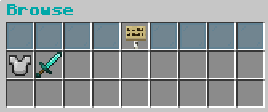

# Handling Professions
## Usage
You open the browse gui with the command `/craft browse`.

<br>

In case you dont want to open the browse gui all the time, you can also skip it by using `/craft join <profession>`

Leaving a profession is also possible with `/craft forget <profession>`. You will then have to confirm your action by typing `/craft confirm` again.

## BrowseGui configuration
The browse gui is used to browse all configurated professions that are available to the player. 
With that being said: Yes, you can also put some professions on 'draft' and edit them until you are satisfied a the creator.
Once the professions are finish, integrate them into the browse gui and let the player choose from them.

You can either use the [Ingame-Editor](../EditorUsage.md) or the config file below which explaines the structure of the browse config:
<details open>
  <summary>Show browse.yml</summary>
  This is the default config that will be generated when you fresh install Fusion or delete the file.

  ```yaml
    # The name of the browse gui
    name: '&3&lBrowse'
    # The Pattern of how you gui is build
    pattern:
      # This is the structure of you items below
      pattern:
        - '111101111'
        - ooooooooo
        - ooooooooo
      # This section allow for custom commands on specific items. For example 'commands.'1' would provide a list of commands that will be executed when the player clicks on the item in the gui.
      # Further details: [TODO]
      commands: {}
      # Those are the items that you can customize inside of the gui. You see that each char represents one item in the pattern above.
      items:
        '0':
          material: BIRCH_SIGN
          amount: 1
          durability: 0
          unbreakable: false
          name: §3Crafting Groups
          lore:
            - §7Select a profession
          flags: []
          enchants: {}
          data: null
        '1':
          material: CYAN_STAINED_GLASS_PANE
          amount: 1
          durability: 0
          unbreakable: false
          name: ' '
          lore: []
          flags: []
          enchants: {}
          data: null
    # Here, you can see all professions that are enabled through the plugin. When a profession is not added here, it cant be used by the players.
    professions:
      # This is the armor smithing profession that is added on fresh install
      armor_smithing:
        # Here is the cost section. Further infos: [TODO]
        costs:
          exp: 10
        # Here is the condition section. Further infos: [TODO]
        conditions: {}
      weapon_smithing:
        costs:
          money: 5
        conditions: {}
  ```
</details>


### Additionals
- Setting the permission `fusion.browse` to false in your permission handler disabled the browse command for the player. If you dont set it at all, its natively active.
- Make sure to visit [Customizing Sections](CustomizationSections.md) for further knowledge about the ItemBuilder, Cost-Section and Condition-Section of professions and even recipes!